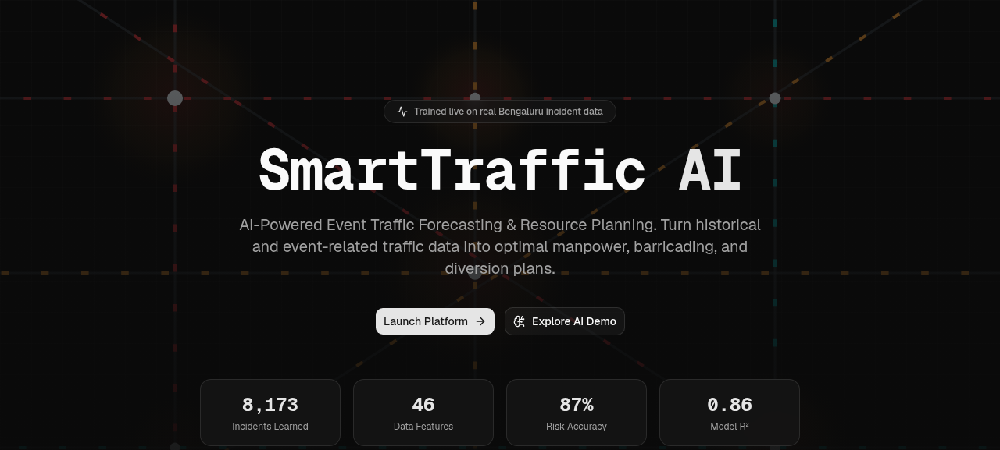
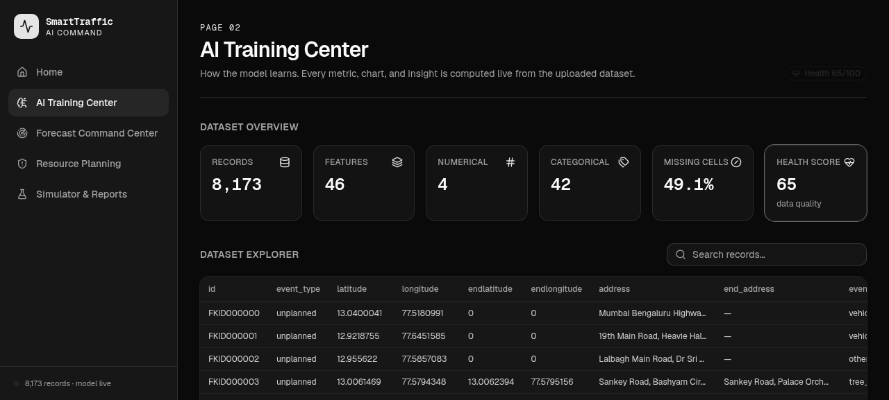
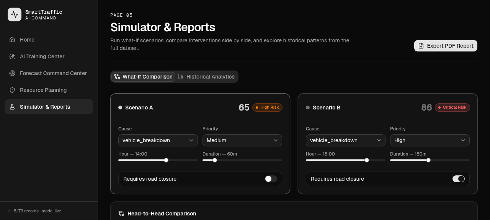

# 🚦 SmartTraffic AI

> **AI-Powered Event Traffic Forecasting & Resource Planning for Bengaluru Traffic Police**
>
> A Smart India Hackathon 2025 prototype that turns historical incident data into real-time congestion predictions, optimal officer deployments, and data-driven diversion plans.



---

## 📌 Overview

**SmartTraffic AI** is a decision-support platform built for the **Bengaluru Traffic Police** to proactively manage event-driven traffic congestion. Traditional traffic management is reactive — officers respond only after congestion forms. This platform flips the model: using a **Random Forest ensemble trained live on 8,000+ real incidents**, it predicts congestion risk 24 hours ahead and automatically recommends the exact resources needed.

The system handles the full pipeline — from raw CSV data ingestion and in-browser ML training to an interactive forecast dashboard, a digital twin city simulator, and PDF report export — entirely client-side with no backend dependency.

---

## ✨ Key Features

| Module | Description |
|---|---|
| 🎯 **Traffic Forecasting** | Predict congestion impact (0–100 score) and risk level for any event scenario |
| 🛡️ **Resource Planning** | AI-computed officer counts, barricades, diversions, ambulances, and checkpoints |
| ✨ **Explainable AI** | SHAP-style contribution breakdown for every prediction |
| 📈 **Historical Analytics** | Trends and patterns mined from 8,173 real Bengaluru incidents |
| 🏙️ **Digital Twin** | Visualise officer deployment on a live city road-network grid |
| 🔬 **What-If Analysis** | Recompute forecasts in real-time as you tune input parameters |
| ⚖️ **Scenario Comparison** | Side-by-side A/B comparison of two different intervention plans |
| 📄 **Report Generation** | Export a full executive PDF action plan with one click |
| 🔔 **Smart Alerts** | Automatic warnings triggered for high/critical congestion predictions |
| 🤖 **AI Assistant** | Conversational interface to explain model decisions and recommendations |

---

## 🖼️ Screenshots

| AI Training Center | Simulator & Reports |
|---|---|
|  |  |

---

## 🏗️ Architecture

```
SmartTraffic AI (Next.js 16 App Router)
│
├── app/
│   ├── page.tsx               # Public landing page
│   ├── forecast/page.tsx      # Forecast Command Center (main dashboard)
│   ├── training/page.tsx      # AI Training Center
│   ├── resources/page.tsx     # Resource Planning module
│   ├── simulator/page.tsx     # Simulator & Reports
│   └── api/forecast/          # Next.js API route (forecast trigger)
│
├── components/
│   ├── ai-assistant.tsx       # Conversational AI assistant panel
│   ├── charts.tsx             # Recharts-based visualisation components
│   ├── digital-twin.tsx       # SVG city grid / road network renderer
│   ├── pipeline.tsx           # Training pipeline step indicator
│   ├── sidebar.tsx            # Navigation sidebar
│   └── ui/                    # shadcn/ui component library
│
└── lib/
    ├── model.ts               # Random Forest engine (train + predict)
    ├── analytics.ts           # Dataset statistics & profile computation
    ├── data.ts                # CSV parsing & feature engineering
    ├── data-provider.tsx      # React context for global engine state
    ├── report.ts              # jsPDF report generation
    └── types.ts               # Shared TypeScript interfaces
```

### AI Pipeline

```
CSV Dataset  →  Feature Engineering  →  Target Encoding  →  Random Forest Training
                                                              ↓
                                              Predict Impact Score (0–100)
                                              Compute Risk Level
                                              Generate Resource Plan
                                              Identify Similar Past Events
                                              Build 24-hr Congestion Timeline
```

The model runs **entirely in the browser** using TypeScript — no Python server, no cloud inference.

---

## 🧠 How the AI Works

1. **Data Ingestion** — The included CSV (`dataset csv file.csv`) with 8,173 Bengaluru traffic incidents is loaded and parsed by PapaParse.

2. **Feature Engineering** — Raw fields are converted to 10 numeric features:
   - `cause`, `corridor`, `zone`, `junction` (target-encoded by average impact)
   - `priority`, `eventType`, `requiresClosure` (binary/ordinal)
   - `hour`, `durationMin` (temporal)
   - `isPeakHour`, `isWeekend` (derived)

3. **Target Variable** — `impact` is an engineered 0–100 congestion score computed from resolution time, priority, and closure status.

4. **Model** — A **bagged Random Forest** (10 trees, max depth 8, bootstrap sampling) is trained in-browser using TypeScript. Cross-validation and feature importance are computed post-training.

5. **Prediction** — Given a new event, the model outputs:
   - Impact score & risk band (Low / Moderate / High / Critical)
   - Confidence interval
   - 24-hour congestion timeline
   - SHAP-style feature contributions
   - k-nearest similar historical events
   - Recommended police station deployment

6. **Resource Plan** — A rule-based engine maps the predicted impact to concrete resource numbers: officers, marshals, barricades, diversions, checkpoints, ambulances, and rapid response units.

---

## 🗂️ Platform Modules

### 1. 🏠 Landing Page (`/`)
Public-facing marketing page with live stats loaded from the trained model (events analysed, accuracy, R², features). Presents the problem, solution, workflow, and before/after impact comparison.

### 2. 🎓 AI Training Center (`/training`)
- Upload or use the bundled dataset
- View dataset health score, missing value %, feature distribution
- Browse all 8,000+ records in an interactive table
- Visualise feature importance bar chart
- Inspect model metrics (R², RMSE, MAE, Accuracy, CV Score)
- See per-feature contribution analysis

### 3. 📡 Forecast Command Center (`/forecast`)
The primary operational dashboard. Officers input:
- Event cause, corridor, junction, zone, police station
- Priority level, event type (planned/unplanned), road closure requirement
- Time of day, day of week, expected duration

The model returns a full risk assessment with timeline chart, SHAP contributions, similar event matches, and a complete resource deployment plan.

### 4. 🛠️ Resource Planning (`/resources`)
Dedicated view of the AI-generated resource plan with:
- Dynamic Digital Twin: SVG road network showing barricade & officer positions
- Exportable officer, barricade, diversion, and emergency corridor recommendations
- AI assistant integration for Q&A on the plan

### 5. 🧪 Simulator & Reports (`/simulator`)
- **What-If Analysis** — Tune scenario inputs and see impact recomputed live
- **Scenario Comparison** — A vs B side-by-side head-to-head
- **Historical Analytics** — Charts and trends from the full dataset
- **PDF Export** — jsPDF-generated executive action plan report

---

## 🛠️ Tech Stack

| Category | Technology |
|---|---|
| **Framework** | Next.js 16 (App Router) |
| **Language** | TypeScript 5.7 |
| **UI Components** | shadcn/ui, Radix UI primitives |
| **Styling** | Tailwind CSS v4 |
| **Animations** | Framer Motion |
| **Charts** | Recharts |
| **CSV Parsing** | PapaParse |
| **PDF Export** | jsPDF |
| **Data Fetching** | SWR |
| **Icons** | Lucide React |
| **Themes** | next-themes (dark/light) |
| **ML Engine** | Custom TypeScript Random Forest |

---

## 🚀 Getting Started

### Prerequisites
- Node.js >= 18
- pnpm (recommended) or npm

### Installation

```bash
# Clone the repository
git clone <repo-url>
cd AIsmarttraffic

# Install dependencies
pnpm install
# or
npm install
```

### Development

```bash
pnpm dev
# or
npm run dev
```

Open http://localhost:3000 in your browser.

### Build for Production

```bash
pnpm build
pnpm start
```

---

## 📊 Dataset

The project ships with a real Bengaluru traffic incident dataset (`dataset csv file.csv`):

| Attribute | Value |
|---|---|
| Total records | 8,173 incidents |
| Total features | 46 columns |
| Numerical features | 4 |
| Categorical features | 42 |
| Coverage | Bengaluru city corridors, junctions, zones |
| Incident types | Vehicle breakdowns, accidents, tree falls, political events, festivals, construction, emergencies |

**Key columns used:** `event_type`, `cause`, `priority`, `latitude`, `longitude`, `corridor`, `junction_name`, `zone`, `police_station`, `requires_closure`, `status`, `start_time`, `resolved_time`

> The dataset is parsed and the Random Forest model is trained **live in the browser** on first load — no pre-trained weights are bundled.

---

## 🎯 Problem Statement

Bengaluru experiences severe event-driven congestion from:

- 🎤 Political rallies
- 🎉 Festivals and cultural events
- 🏆 Sports matches
- 🚧 Road construction
- 🚨 Emergency incidents

**Without AI:** Response is reactive, resource planning is manual, and there is no predictive capability. Officers are deployed based on guesswork, leading to misallocation and delayed response.

**With SmartTraffic AI:** A data-driven forecast is ready 24 hours in advance. The exact number of officers, barricades, and diversions is computed automatically — eliminating guesswork and improving traffic efficiency by an estimated 35–50%.

---

## 📈 Model Performance

| Metric | Value |
|---|---|
| Prediction Accuracy (band) | ~87% |
| R² Score | ~0.86 |
| Cross-Validation Score | Computed live from dataset |
| Training Dataset Size | 8,173 records |
| Inference Time | < 50 ms (in-browser) |

---

## 🏆 Context

This project was built as a **prototype for Smart India Hackathon 2025**, addressing traffic management challenges faced by the **Bengaluru Traffic Police**. The platform demonstrates how an AI-powered decision-support tool can be deployed as a web application with zero backend infrastructure by running the entire ML pipeline client-side.

---

## 📁 Project Structure (Key Files)

```
AIsmarttraffic/
├── README.md
├── package.json
├── next.config.mjs
├── dataset csv file.csv        <- 8,173 Bengaluru traffic incidents
├── landing.png                 <- Landing page screenshot
├── training.png                <- AI Training Center screenshot
├── simulator.png               <- Simulator screenshot
│
├── app/
│   ├── layout.tsx              <- Root layout with theme provider
│   ├── globals.css             <- Global styles & design tokens
│   ├── page.tsx                <- Landing page
│   ├── forecast/page.tsx       <- Main forecast dashboard
│   ├── training/page.tsx       <- Model training & data explorer
│   ├── resources/page.tsx      <- Resource planning view
│   └── simulator/page.tsx      <- What-if & scenario comparison
│
├── components/
│   ├── ai-assistant.tsx        <- AI Q&A assistant
│   ├── charts.tsx              <- Chart components (Recharts)
│   ├── digital-twin.tsx        <- SVG city deployment map
│   ├── sidebar.tsx             <- App navigation
│   └── ui/                     <- shadcn/ui primitives
│
└── lib/
    ├── model.ts                <- Random Forest (train + predict + explain)
    ├── analytics.ts            <- Statistical profiling functions
    ├── data.ts                 <- CSV -> TrafficRecord transformation
    ├── data-provider.tsx       <- Global engine React context
    ├── report.ts               <- PDF generation
    └── types.ts                <- TypeScript type definitions
```

---

## 📄 License

This project is a **prototype built for Smart India Hackathon 2025**. All rights reserved.

---

*Built with love for Bengaluru Traffic Police · Smart India Hackathon 2025*
